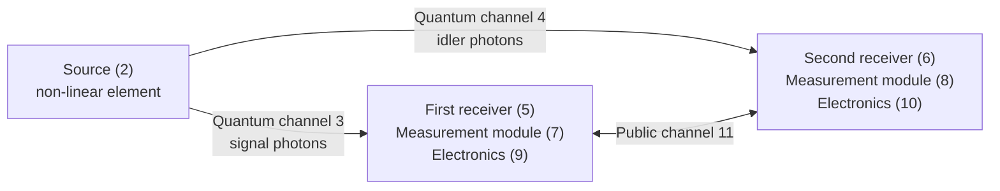
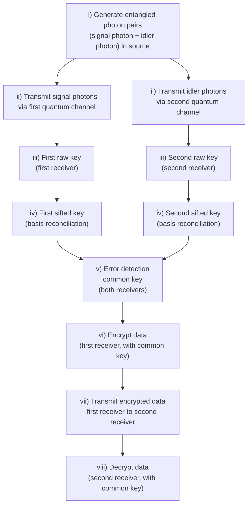
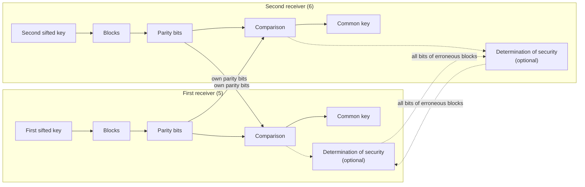

## DE 10 2022 126 262 A1

---

### Bibliographic data

| Field | Content |
|---|---|
| (19) | German Patent and Trade Mark Office [Deutsches Patent- und Markenamt] |
| (10) | DE 10 2022 126 262 A1, 2024.04.11 |
| (12) | Published Patent Application [Offenlegungsschrift] |
| (21) | File number: 10 2022 126 262.6 |
| (22) | Filing date: 11.10.2022 |
| (43) | Date of publication: 11.04.2024 |
| (51) | Int. Cl.: H04L 9/08 (2006.01) |
| (71) | Applicant: Quantum Optics Jena GmbH, 07745 Jena, DE |
| (74) | Representative: LOUIS PÖHLAU LOHRENTZ Patentanwälte Partnerschaft mbB, 90409 Nuremberg, DE |
| (72) | Inventor: Heilmann, René, 99195 Schwansee, DE |
| (56) | Prior art cited: US 2013/0315395 A1; EP 3 607 446 B1; KLØVE, Torleiv: *Codes for Error Detection*. Series on Coding Theory and Cryptology: Vol. 2, World Scientific Publishing Co. Pte. Ltd., 2007, pp. 1-3, 19-20, 142-149. ISBN-13 978-981-270-586-0 |

An examination request pursuant to Section 44 of the German Patent Act (Patentgesetz) has been filed.

The following particulars are taken from the documents filed by the applicant.

**(54) Title: Error detection for quantum key exchange**

---

### (57) Abstract

A method is proposed for data transmission between a first receiver (5) and a second receiver (6) with quantum key exchange, wherein error detection is carried out between a first sifted key and a second sifted key to generate a common key at both receivers (5, 6).

It is essential that, for error detection, the sifted keys are each divided into blocks, and that one or more parity bits are subsequently computed for each block, and that the one or more parity bits are subsequently transmitted to the respective other receiver, and that erroneous blocks are subsequently determined at both the first receiver (5) and the second receiver (6) by comparing the computed one or more parity bits with the one or more parity bits received from the respective other receiver, and that, to generate the common key, the erroneous blocks of the first sifted key and of the second sifted key are discarded at both the first receiver (5) and the second receiver (6).

---

### Description

**[0001]** The invention relates to a method for data transmission with quantum key exchange according to the features of the preamble of claim 1, and to a system for data transmission with quantum key exchange according to the features of the preamble of claim 14.

**[0002]** For secure data transmission, data is transmitted in encrypted form from a sender to a receiver. For this purpose, the sender and the receiver agree upon a key for encrypting and decrypting the message to be transmitted. A known way of generating such a key is quantum key distribution (Quantum Key Distribution, QKD) and a corresponding method for key generation.

**[0003]** The generation of a key by quantum key distribution (QKD), for example using polarization-entangled photon pairs, is far superior to classical key generation, because the security of this type of generation is not based on a mathematical computation or on an algorithm of the system, but on physical laws of nature, i.e. on the entanglement of the photon pairs. For a quantum key distribution (QKD), the entangled photon pairs are generated in a source, and one photon of each photon pair is transmitted to the sender of the data to be transmitted (hereinafter referred to as the first receiver) and to the receiver of the data to be transmitted (hereinafter referred to as the second receiver), and is measured there for key generation.

**[0004]** By means of the method for quantum key distribution (QKD), the key is generated at both the first receiver and the second receiver. That is, the generated key does not need to be transmitted between the first receiver and the second receiver.

**[0005]** Such methods comprise the steps of generating a raw key, for example by generating, transmitting, and measuring entangled photon pairs in specific measurement bases. Subsequently, the measurement bases used are compared between the sender and the receiver, and bits of the raw key that were generated by measurement of a photon pair in two different measurement bases are discarded. As a next step, such methods proceed to the calculation of the quantum bit error rate (QBER) and the post-processing of the data, i.e. for example error correction and privacy amplification.

**[0006]** The advantage of quantum key distribution (QKD) over classical key generation lies, among other things, in the fact that, for example by calculating the quantum bit error rate (QBER), it can be determined whether the key is secure or insecure. Only in the case of a secure key are the data to be transmitted encrypted and transmitted to the receiver, after security has been determined. It is essential for the data transmission that error-free encryption and decryption can only be guaranteed given error-free key generation. For this purpose, known methods perform error correction. Such error-correction steps require moderate amounts of data and reduce the remaining secrecy of the key material.

**[0007]** The object underlying the present invention is to provide an improved method and a corresponding system for secure and error-free key generation in a quantum key distribution (QKD), preferably to provide secure and error-free data transmission comprising key generation in a quantum key distribution (QKD), preferably also at a low key rate.

**[0008]** The object is achieved according to the invention by a method for data transmission with quantum key distribution having the features of claim 1.

**[0009]** According to the invention, a method is proposed for data transmission between a first receiver and a second receiver of photons for quantum key exchange, the method comprising the following steps:

- i) generating entangled photon pairs, each having a signal photon and an idler photon, in a source;
- ii) transmitting the signal photons in a first quantum channel to the first receiver, and transmitting the idler photons in a second quantum channel to the second receiver;
- iii) generating a first raw key at the first receiver and a second raw key at the second receiver by measuring the signal photons and the idler photons and determining the photon pairs;
- iv) generating a first sifted key at the first receiver from the first raw key, and generating a second sifted key at the second receiver from the second raw key, by basis reconciliation;
- v) error detection between the first sifted key and the second sifted key to generate a common key at both receivers;
- vi) encrypting the data to be transmitted at the first receiver with the common key;
- vii) transmitting the encrypted data from the first receiver to the second receiver;
- viii) decrypting the encrypted data at the second receiver with the common key.

**[0010]** It is essential that, in step v), the first sifted key and the second sifted key are each divided into blocks, and

that, in step v), one or more parity bits are subsequently computed for each block, preferably separately from one another at the first receiver and at the second receiver, and

that, in step v), the one or more parity bits of the blocks are subsequently transmitted to the respective other receiver, and

that, in step v), erroneous blocks are subsequently determined at both the first receiver and the second receiver (preferably each determined within the receiver's own sifted key) by comparing the computed one or more parity bits with the one or more parity bits received from the respective other receiver, for each block, and

that, in step v), to generate the common key, the erroneous blocks of the first sifted key and of the second sifted key are discarded at both the first receiver and the second receiver.

**[0011]** The object is further achieved according to the invention by a system for data transmission between a first receiver and a second receiver with quantum key distribution having the features of claim 14.

**[0012]** According to the invention, a system is proposed for data transmission between a first receiver and a second receiver with quantum key distribution, wherein the system comprises a source, the first receiver, and the second receiver, and wherein data transmission takes place between the first receiver and the second receiver, and

wherein the source comprises a non-linear element for generating entangled photon pairs, each having a signal photon and an idler photon, and

wherein the source is connected via a quantum channel to the first receiver for transmission of the signal photons, and the source is connected via a second quantum channel to the second receiver for transmission of the idler photons, and

wherein the first receiver comprises a first measurement module for measuring the signal photons and a first electronics unit for processing and storing the measurement results of the first measurement module, preferably for generating a first raw key and a first sifted key, and wherein the second receiver comprises a second measurement module for measuring the idler photons and a second electronics unit for processing and storing the measurement results of the second measurement module, preferably for generating a second raw key and a second sifted key. It is essential that the first receiver and the second receiver are connected to one another via a public channel, both for basis reconciliation and for error detection, and

that the first electronics unit is configured to determine erroneous blocks in a first sifted key in order to generate a common key, and

that the second electronics unit is configured to determine erroneous blocks in a second sifted key in order to generate the common key.

**[0013]** The method according to the invention and the device according to the invention enable secure and error-free data transmission even under disruptive external influences, such as, for example, erroneous detection of the photons at the receivers, for instance due to stray light or thermal effects (dark counts), or the destruction of the entanglement of a photon pair by a third party. These external influences are recognized and taken into account during key generation. The method according to the invention and the device according to the invention thus counteract disturbances due to random and/or external circumstances in order to guarantee secure and error-free data transmission. An advantage is that the given disturbance factors in the quantum channels and in the components of the source and the receivers are reliably detected by the technical means of information exchange and data processing.

**[0014]** An advantage of the method according to the invention and the device according to the invention lies in the respectively independent computation of the parity bits at both the first receiver and the second receiver. The advantage is that this information is used by both receivers to generate the common key by discarding the erroneous data, i.e. that both the electronics of the first receiver and the electronics of the second receiver are configured for such steps. The two receivers each receive the information about the measurement bases and the parity bits and each process their own data in an identical manner. In contrast, in known error-correction methods the common key is generally generated by having one of the two receivers adapt its sifted key to the sifted key of the other receiver by correction steps, i.e. by correcting individual bits.

**[0015]** A further advantage of the method according to the invention and the device according to the invention lies in discarding the erroneous blocks on both sides in order to generate the common key, without performing correction steps. In known methods, such correction steps are used to correct bit flips in the key. A disadvantage of this is that, in known methods, such correction steps allow the key material to be manipulated, for example by infiltrating the classical channel used to exchange the parity bits. In the method according to the invention and the device according to the invention, such manipulation of the key material is excluded.

**[0016]** A further advantage of the method according to the invention and the device according to the invention lies in the targeted choice of block size, whereby secure and error-free data transmission is possible promptly even at a low key generation rate. In contrast, known error-correction methods are only possible from a certain key length onward, which is disadvantageous in a quantum key distribution (QKD).

**[0017]** A further advantage of the method according to the invention and the device according to the invention is that only the parity bits are transmitted for error detection, but no parts of the common key or information for correcting the common key, which would enable manipulation of the common key.

**[0018]** A further advantage is that the method according to the invention enables a secure system for data transmission, wherein the system comprises a source, a first receiver, and a second receiver, and wherein data transmission takes place between the first receiver and the second receiver, and wherein the source comprises a non-linear element for generating entangled photon pairs, each having a signal photon and an idler photon, wherein the source is connected via a first quantum channel to the first receiver for transmission of the signal photons and the source is connected via a second quantum channel to the second receiver for transmission of the idler photons, and wherein the first receiver comprises a first measurement module for measuring the signal photons and a first electronics unit for generating the first raw key, the first sifted key, and the common key, as well as for error detection and for encrypting the data, and wherein the second receiver comprises a second measurement module for measuring the idler photons and a second electronics unit for generating the second raw key, the second sifted key, and the common key, as well as for error detection and for decrypting the data, and comprising a public channel between the first receiver and the second receiver for basis reconciliation as well as for error detection.

**[0019]** A further advantage of the method according to the invention and the device according to the invention is that the information in the erroneous blocks can be used further, for example for determining security, for the precise calculation of the quantum bit error rate (QBER), of the fidelity, or of the visibility.

**[0020]** It may be provided that the error detection in step v) is carried out at the first receiver in the first electronics unit and at the second receiver in the second electronics unit. It may be provided that the first electronics unit and the second electronics unit are configured to carry out step v).

**[0021]** It may be provided that the error detection in step v) of the first sifted key is carried out in the first electronics unit. It may be provided that the error detection in step v) of the second sifted key is carried out in the second electronics unit.

**[0022]** It may be provided that the blocks have different block lengths, or that each block has a fixed block length of m bits. It is essential that the first sifted key and the second sifted key are each divided into the same blocks.

**[0023]** It may be provided that the computation of the one or more parity bits at the first receiver is carried out in the first electronics unit for the blocks of the first sifted key, and that the computation of the one or more parity bits at the second receiver is carried out in the second electronics unit for the blocks of the second sifted key.

**[0024]** It may be provided that, to transmit the parity bits, the computed one or more parity bits of each block of the first receiver are transmitted to the second receiver, and that the computed one or more parity bits of each block of the second receiver are transmitted to the first receiver.

**[0025]** It may be provided that the transmission of the one or more parity bits of each block takes place over a public channel.

**[0026]** It may be provided that the one or more parity bits are computed by $\vec{M}G^{T} = \vec{P}$, with the generator matrix $G$ of size $p \times m$, where $m$ is the length of a block $\vec{M}$ and $p$ is the number of parity bits $\vec{P}$.

**[0027]** It may be provided that a separate generator matrix $G$ of size $p \times m$ is used for each block size to compute the one or more parity bits. It may be provided that, for a fixed block size, a single generator matrix $G$ of size $p \times m$ is used to compute the one or more parity bits.

**[0028]** It may be provided that the generator matrix $G$ is configured such that a low number of bit errors is detected with the highest possible probability. A low number of bit errors here means the number of non-matching bits in a corresponding block of the first and second receiver.

**[0029]** It may be provided that the generator matrix $G$ is configured such that the number of computed parity bits is smaller than the block size, $p < m$. With such a generator matrix $G$, a remaining secret can be guaranteed.

**[0030]** It may be provided that the one or more parity bits of the respective corresponding blocks of the first sifted key and of the second sifted key are compared with one another. A block, i.e. the block of the receiver's own sifted key and the corresponding block at the other receiver, is regarded as erroneous if one or more of the self-computed and the transmitted one or more parity bits of the block and of the corresponding block differ from one another.

**[0031]** It may be provided that the error detection in step v) is first carried out with a first generator matrix $G_1$ to generate a first common key, and that subsequently a further error detection is carried out on the first common key, or on the first and second sifted keys, with a second generator matrix $G_2$, in order to generate the common key. When the second generator matrix $G_2$ is applied to the first common key, the common key can be generated analogously to the preceding description, using the first common key instead of the first and second sifted keys. When the second generator matrix $G_2$ is applied to the first and second sifted keys, only blocks that have no erroneous bits under both the first generator matrix $G_1$ and the second generator matrix $G_2$ may, for example, be used to generate the common key. It may be provided that the first generator matrix $G_1$ and the second generator matrix $G_2$ differ from one another. With such a method, it is also possible to identify blocks that do have differing bits but nevertheless yield identical parity bits under the first generator matrix $G_1$ used. Alternatively, in a second step, instead of the steps using a second generator matrix $G_2$, other methods may be applied that are based on a redundancy check, such as the CRC method, or on an integrity check, such as the hash method.

**[0032]** It may be provided that, after the error detection in step v), the security of the common key is determined. It may be provided that the first electronics unit and the second electronics unit are configured to determine the security of the common key.

**[0033]** It may be provided that the quantum bit error rate (QBER) is computed to determine the security of the common key. It may be provided that the quantum bit error rate (QBER) is computed from the first sifted key and the second sifted key. It may be provided that the fidelity or the visibility is computed to determine the security of the common key.

**[0034]** It may be provided that, to compute the quantum bit error rate (QBER), all bits of the respectively corresponding erroneous blocks are exchanged between the two receivers. The advantage is that these bits of the erroneous blocks can be exchanged publicly, since they are not used to generate the common key.

**[0035]** It may be provided that the exchange of all bits of the erroneous blocks takes place over a public channel, preferably for determining security.

**[0036]** It may be provided that the quantum bit error rate is computed from the number of all bits of the erroneous blocks and of the non-erroneous blocks. It may be provided that the quantum bit error rate is computed as the ratio of the erroneous bits of the erroneous blocks to the number of all bits of the erroneous and non-erroneous blocks. The advantage of this embodiment is that no additional, randomly selected bits, which subsequently could no longer be used to generate the common key, are needed to compute the quantum bit error rate. A further advantage of this embodiment is that all bits are used to compute the quantum bit error rate, since the bits of the non-erroneous blocks are also included in the computation. In known methods for computing the quantum bit error rate, only randomly selected bits are used, which subsequently have to be discarded. Discarding these randomly chosen bits leads, in known methods, to a further reduction of the key rate.

**[0037]** Because all bits of the sifted keys are used for the quantum bit error rate, a much more precise computation is possible in comparison with known methods.

**[0038]** It may be provided that the QBER is computed by

$$\text{QBER} = \frac{\text{number of all erroneous bits in the erroneous blocks}}{\text{number of all bits in the sifted key}}$$

**[0039]** As a non-exclusive example, for the computation of the QBER a sifted key of 12 bits is assumed, with one erroneous bit in this key, whereby a QBER of $\text{QBER} = \tfrac{1}{12} = 8.33\%$ can be computed.

**[0040]** It may be provided that, from a quantum bit error rate QBER < 11%, preferably QBER < 8%, the common key is regarded as secure.

**[0041]** It may be provided that the entangled photons are entangled in polarization, and/or in time (time-bin), and/or in orbital angular momentum.

**[0042]** It may be provided that the entangled photons, preferably in step i), are generated by a non-linear process in the non-linear element, preferably by parametric fluorescence (Spontaneous Parametric Down-Conversion, SPDC) or spontaneous four-wave mixing (Spontaneous Four-Wave Mixing, SFWM). It may be provided that the non-linear element is arranged in a Sagnac configuration, a linear configuration, a BBO configuration, or a four-wave-mixing configuration with a cavity, in order to generate polarization-entangled photon pairs.

**[0043]** It may be provided that the quantum channel is a free-space quantum channel and/or a fiber quantum channel.

**[0044]** It may be provided that, to generate the first raw key, the signal photons are measured in step iii) in a first measurement module of the first receiver.

**[0045]** It may be provided that, to generate the second raw key, the idler photons are measured in step iii) in a second measurement module of the second receiver.

**[0046]** It may be provided that, in steps ii) and iii), the signal photons are transmitted to the second receiver and the second raw key is thereby generated at the second receiver, and that the idler photons are transmitted to the first receiver and the first raw key is thereby generated at the first receiver. It is essential to steps ii) and iii) that entangled photon pairs are used.

**[0047]** It may be provided that the measurement of the signal photons and of the idler photons in step iii) takes place in at least two mutually unbiased measurement bases.

**[0048]** It may be provided that the choice of measurement bases in step iii) is random, preferably random at the first receiver and, independently thereof, random at the second receiver, preferably random for each signal photon or idler photon.

**[0049]** It may be provided that each measured signal photon of a measured photon pair generates one bit in the first raw key. It may be provided that each measured idler photon of a measured photon pair generates one bit in the second raw key.

**[0050]** It may be provided that each bit in the first raw key, generated by a signal photon of a particular photon pair, is associated with the corresponding bit in the second raw key, generated by the corresponding idler photon of the photon pair.

**[0051]** It may be provided that coincidences of the entangled photon pairs are used to generate the bits of the first raw key and of the second raw key. It may be provided that, to determine the coincidences, the time of measurement is transmitted between the two receivers, preferably over a secure or encrypted or public channel. The advantage is that transmission is also possible over a public channel without compromising the generation of the common key.

**[0052]** It may be provided that, to determine the photon pairs in step iii), the time of detection of the signal photons and of the idler photons is exchanged in order to determine coincidences. Coincidence means the simultaneous measurement of the signal photon and the idler photon of a photon pair at the two receivers (simultaneous meaning detection of the photons that correlate with the same emission time at the source).

**[0053]** It may be provided that the first raw key and the second raw key additionally comprise, for each bit, the information of the measurement basis used.

**[0054]** It may be provided that the plurality of entangled photon pairs are generated sequentially in time in step i). It may be provided that the plurality of entangled photon pairs are transmitted sequentially in time in step ii). It may be provided that the plurality of entangled photon pairs are measured sequentially in time in step iii). It may be provided that further photon pairs are already being generated during the transmission and/or measurement.

**[0055]** It may be provided that the first receiver comprises a first electronics unit for processing and storing the measurement results of the first measurement module and the first raw key. It may be provided that the second receiver comprises a second electronics unit for processing and storing the measurement results of the second measurement module and the second raw key.

**[0056]** It may be provided that the first electronics unit and/or the second electronics unit is configured as hardware-based electronics, for example based on ASICs or FPGAs, and/or as software-based electronics, for example comprising a microprocessor or a signal processor and an executable software program.

**[0057]** It may be provided that, during basis reconciliation, the measurement bases used from step iii) are transmitted and/or compared between the two receivers for each bit of the first and second raw key.

**[0058]** It may be provided that the transmission of the measurement bases takes place over a public channel. A public channel is understood to mean any connection for data transmission that may also be accessible to the public.

**[0059]** It may be provided that, during basis reconciliation, the bits generated by a photon pair in the first raw key and in the second raw key are discarded if they were measured in different ones of the mutually unbiased measurement bases. It may be provided that, during basis reconciliation, the bits generated by a photon pair in the first raw key and in the second raw key that were measured in the same one of the mutually unbiased measurement bases generate the first sifted key and the second sifted key.

**[0060]** It may be provided that the common key is stored at both receivers, preferably in the first electronics unit and the second electronics unit, prior to encryption of the data.

**[0061]** It may be provided that the encryption of the data is carried out in the first electronics unit of the first receiver, and/or that the decryption of the data is carried out in the second electronics unit of the second receiver.

**[0062]** It may be provided that the transmission of the encrypted data takes place over a public channel.

**[0063]** It may be provided that the system is configured to carry out the method according to any of the previously described embodiments. It may be provided that the first electronics unit and the second electronics unit are configured to carry out steps iii) to vii) of the method.

### Worked examples (parity computation)

**[0064]** As a non-exclusive first example, the computation of 3 parity bits for 4-bit blocks ($m = 4$) is carried out below. This yields a code rate of 4/7 (the proportion of the original message within the total information), where the remaining secret corresponds to 25%, i.e. 1 bit per block.

**[0065]** As a non-exclusive first embodiment, the following generator matrix $G$ is used:

$$G = \begin{pmatrix} 1 & 0 & 1 & 0 \\ 1 & 1 & 0 & 1 \\ 0 & 0 & 1 & 1 \end{pmatrix}$$

**[0066]** The 3 parity bits $\vec{P}$ per block $\vec{M}$ can be computed by $\vec{M}G^{T} = \vec{P}$, with the generator matrix $G$ of size $p \times m$, where $m$ is the length of a block and $p$ is the number of parity bits $\vec{P}$.

**[0067]** For a block size of $m = 4$ bits, there are potentially 16 different bit combinations, i.e. 16 different blocks are possible. From these 16 different blocks, various combinations of 3-bit parity bits can be computed using the aforementioned generator matrix $G$.

**[0068]** From:

| $\vec{M}$ (pair) | $\vec{P}$ |
|---|---|
| $(0\,0\,0\,0)$ and $(1\,0\,1\,1)$ | $(0\,0\,0)$ |
| $(0\,1\,0\,1)$ and $(1\,1\,1\,1)$ | $(0\,0\,1)$ |
| $(0\,1\,0\,0)$ and $(1\,1\,1\,1)$ | $(0\,1\,0)$ |
| $(0\,0\,0\,1)$ and $(1\,0\,1\,0)$ | $(0\,1\,1)$ |
| $(0\,1\,1\,1)$ and $(1\,1\,0\,0)$ | $(1\,0\,0)$ |
| $(0\,0\,1\,0)$ and $(1\,0\,0\,1)$ | $(1\,0\,1)$ |
| $(0\,0\,1\,1)$ and $(1\,0\,0\,0)$ | $(1\,1\,0)$ |
| $(0\,1\,1\,0)$ and $(1\,1\,0\,1)$ | $(1\,1\,1)$ |

**[0069]** After each independently computing their own blocks, the two receivers exchange the parity bits. The two receivers then compare their own computed parity bits with the parity bits of the blocks received from the respective other receiver. If the parity bits of the receiver's own computation and of the transmission of the respectively corresponding blocks differ, this block is recognized as erroneous at both the first receiver and the second receiver.

**[0070]** It should be noted that, with the computation using the generator matrix $G$ described above, two different blocks are respectively produced with identical parity bits (a collision). As a result, certain errors in the message bits cannot be detected, as for example with $\vec{M} = (0\,0\,0\,0)$ and $\vec{M} = (1\,0\,1\,1)$ in the preceding list. This means that 2 collisions arise per set of parity bits, since one set of parity bits can be assigned to two different blocks.

**[0071]** In this first non-exclusive embodiment, the generator matrix $G$ is chosen such that certain 3-bit errors cannot be detected, i.e. such that at least 3 bits in the corresponding blocks must differ.

**[0072]** The number of all possible bit errors between two blocks of $m$ bits each can be computed by

$$\text{No. of bit errors} = \frac{1}{2} \cdot \frac{2^{m}!}{(2^{m}-2)!} = \frac{1}{2} \cdot 2^{m} \cdot (2^{m}-1)$$

**[0073]** In this first non-exclusive embodiment with $m = 4$, 120 possible combinations of bit errors result. 8 of these combinations are not detected. All remaining 112 combinations are detected by non-matching parity bits between the two receivers.

**[0074]** In detail, this means:

- 100% of 1-bit errors are detected (32 of 32 possible 1-bit errors)
- 100% of 2-bit errors are detected (48 of 48 possible 2-bit errors)
- 75% of 3-bit errors are detected (24 of 32 possible 3-bit errors)
- 100% of 4-bit errors are detected (8 of 8 possible 4-bit errors)

**[0075]** As a second non-exclusive embodiment, a second generator matrix $G$ is given, with

$$G = \begin{pmatrix} 1 & 1 & 1 & 1 \\ 1 & 1 & 1 & 0 \\ 0 & 1 & 1 & 0 \end{pmatrix}$$

**[0076]** With such a second generator matrix $G$, the 8 non-detectable errors shift entirely into the 4-bit error combinations:

- 100% of 1-bit errors are detected (32 of 32 possible 1-bit errors)
- 100% of 2-bit errors are detected (48 of 48 possible 2-bit errors)
- 100% of 3-bit errors are detected (32 of 32 possible 3-bit errors)
- 0% of 4-bit errors are detected (0 of 8 possible 4-bit errors)

**[0077]** The advantage is that such 4-bit errors occur less probably than the 3-bit errors of the generator matrix $G$ described previously.

**[0078]** As a third non-exclusive example, the computation of 3 parity bits for 6-bit blocks ($m = 6$) is carried out below. This yields a code rate of 2/3, where the remaining secret corresponds to 50%, i.e. 3 bits per block.

**[0079]** As a non-exclusive third example, the following generator matrix $G$ is used:

$$G = \begin{pmatrix} 0 & 0 & 0 & 1 & 1 & 1 \\ 1 & 1 & 0 & 1 & 0 & 0 \\ 1 & 0 & 1 & 1 & 1 & 0 \end{pmatrix}$$

**[0080]** The 3 parity bits $\vec{P}$ per block $\vec{M}$ can be computed by $\vec{M}G^{T} = \vec{P}$, with the generator matrix $G$ of size $p \times m$, where $m$ is the length of a block and $p$ is the number of parity bits $\vec{P}$.

$$
\begin{aligned}
(0\,0\,0\,0\,0\,0)\cdot G^{T} &= (0\,0\,0) \\
(0\,0\,0\,0\,0\,1)\cdot G^{T} &= (1\,0\,0) \\
(0\,0\,0\,0\,1\,0)\cdot G^{T} &= (1\,0\,1) \\
(0\,0\,0\,0\,1\,1)\cdot G^{T} &= (0\,0\,1) \\
&\ \ \vdots \\
(1\,1\,1\,1\,0\,0)\cdot G^{T} &= (1\,1\,1) \\
(1\,1\,1\,1\,0\,1)\cdot G^{T} &= (0\,1\,1) \\
(1\,1\,1\,1\,1\,0)\cdot G^{T} &= (0\,1\,0) \\
(1\,1\,1\,1\,1\,1)\cdot G^{T} &= (1\,1\,0)
\end{aligned}
$$

**[0081]** In this embodiment, 8 collisions arise for each set of parity bits. This is given below, by way of example, for the parity bits $(0\,0\,0)$:

| | $\vec{M}$ | $\vec{P} = \vec{M}G^{T}$ |
|---|---|---|
| a) | $(0\,0\,0\,0\,0\,0)$ | $(0\,0\,0)$ |
| b) | $(0\,0\,1\,0\,1\,1)$ | $(0\,0\,0)$ |
| c) | $(0\,1\,0\,1\,1\,0)$ | $(0\,0\,0)$ |
| d) | $(0\,1\,1\,1\,0\,1)$ | $(0\,0\,0)$ |
| e) | $(1\,0\,0\,1\,0\,1)$ | $(0\,0\,0)$ |
| f) | $(1\,0\,1\,1\,1\,0)$ | $(0\,0\,0)$ |
| g) | $(1\,1\,0\,0\,1\,1)$ | $(0\,0\,0)$ |
| h) | $(1\,1\,1\,0\,0\,0)$ | $(0\,0\,0)$ |

**[0082]** In this embodiment, the generator matrix $G$ is chosen such that these blocks differ by 3 bits or 4 bits. With $m = 6$, 2016 errors are possible between two messages.

$$\text{No. of bit errors} = \frac{1}{2}\cdot 2^{n}\cdot(n^{2}-1),\ n=6 \Rightarrow \frac{1}{2}\cdot 64 \cdot 65 = 2016$$

**[0083]** The number of non-detectable errors can be computed analogously. With $q$ = number of parity bits and $k$ = number of collisions per set of parity bits, this gives:

$$\text{No. of non-detected bit errors} = \frac{2^{q}}{2}\cdot k \cdot (k-1),\ q=3,\ k=8 \Rightarrow \frac{8}{2}\cdot 8 \cdot 7 = 224$$

**[0084]** With $m = 6$ and this generator matrix $G$, 1792 errors are thus detectable (88.9%) and 224 errors are not detectable (11.1%).

**[0085]** In detail, this means:

- 100% of 1-bit errors are detected (192 of 192)
- 100% of 2-bit errors are detected (480 of 480)
- 80% of 3-bit errors are detected (512 of 640)
- 80% of 4-bit errors are detected (384 of 480)
- 100% of 5-bit errors are detected (192 of 192)
- 100% of 6-bit errors are detected (32 of 32)

**[0086]** In comparison with the non-exclusive embodiments described above, it can be noted regarding the third non-exclusive embodiment that the errors are 89% detectable (compared with 93% for the second non-exclusive embodiment), but that the remaining secret has doubled from 25% to 50% in comparison with the second non-exclusive embodiment.

### Description of the figures

**[0087]** Further embodiments of the invention are shown in the figures and described below. The figures show, by way of example, one possible configuration of the invention. This configuration serves to illustrate one possible implementation of the invention and is not to be understood as limiting. They show:

- **Fig. 1**: a schematic representation of the system according to the invention for data transmission with quantum key distribution;
- **Fig. 2**: a schematic representation of the method steps of the method according to the invention for data transmission with quantum key distribution, performed by the system for data transmission with QKD;
- **Fig. 3**: a schematic representation, in detail, of step v) according to the invention, starting from the first sifted key and the second sifted key from step iv);
- **Fig. 4a**: a schematic representation of bits of a first raw key and of a second raw key;
- **Fig. 4b**: a schematic representation of bits of a first sifted key and of a second sifted key from the raw keys of Fig. 4a;
- **Fig. 4c**: a schematic representation of the blocks of the first sifted key and of the second sifted key from Fig. 4b;
- **Fig. 4d**: a schematic representation of the bits of a common key generated from the sifted keys of Fig. 4c.

**[0088]** Fig. 1 shows a schematic representation of the system 1 for data transmission with quantum key exchange. The system 1 comprises a source 2, which is connected via a first quantum channel 3 to a first receiver 5 and is connected via a second quantum channel 4 to a second receiver 6.

**[0089]** The source 2 comprises a non-linear element (not shown in Fig. 1) for generating entangled photon pairs. Each photon pair here comprises a signal photon and an idler photon. The signal photon of each photon pair is transmitted via the first quantum channel 3 to the first receiver 5. The idler photon of each photon pair is transmitted via the second quantum channel 4 to the second receiver 6.

#### Fig. 1: system for data transmission with quantum key distribution

**[0090]** The first receiver 5 comprises a first measurement module 7 for measuring the signal photons. The first measurement module 7 is configured such that it measures the signal photons of the entangled photon pairs in at least two mutually unbiased measurement bases. The selection of the measurement basis for each signal photon is random. The first receiver 5 further comprises a first electronics unit 9 for processing and storing the measurement results of the first measurement module 7, as well as for generating a common key by quantum key distribution, i.e. generating a first raw key, generating a first sifted key, error detection, and thereby generating the common key.

**[0091]** The second receiver 6 comprises a second measurement module 8 for measuring the idler photons. The second measurement module 8 is configured such that it measures the idler photons of the entangled photon pairs in at least two mutually unbiased measurement bases. The selection of the measurement basis for each idler photon is random. The second receiver 6 further comprises a second electronics unit 10 for processing and storing the measurement results of the second measurement module 8, as well as for generating a common key by quantum key distribution, i.e. generating a second raw key, generating a second sifted key, error detection, and thereby generating the common key.

**[0092]** The system 1 further comprises a public channel 11, via which the first receiver 5 and the second receiver 6, preferably via the first electronics unit 9 and the second electronics unit 10, can communicate with one another. Communication over the public channel 11 may be used for basis reconciliation, i.e. to generate the first sifted key and the second sifted key, for error detection, and/or to determine the security of the common key.

**[0093]** Fig. 2 shows the method steps carried out by the system 1 for data transmission between a first receiver 5 and a second receiver 6 with quantum key distribution, wherein the source 2, the first quantum channel 3, the second quantum channel 4, the first receiver 5 with the first measurement module 7 and the first electronics unit 9, the second receiver 6 with the second measurement module 8 and the second electronics unit 10, as well as the public channel 11, for example from Fig. 1, are configured to carry out steps i) to viii).

**[0094]** In step i), the source 2 generates entangled photon pairs, each having a signal photon and an idler photon, by a non-linear process, for example by parametric fluorescence (Spontaneous Parametric Down-Conversion, SPDC) or spontaneous four-wave mixing (Spontaneous Four-Wave Mixing). In step ii), the signal photons of each photon pair are transmitted via the first quantum channel 3 to the first receiver 5. The first receiver 5, with the first measurement module 7 and the first electronics unit 9, and the corresponding method steps, are shown in Fig. 2 by the method steps on the left-hand side. In step ii), the idler photons of each photon pair are transmitted via the second quantum channel 4 to the second receiver 6. The second receiver 6, with the second measurement module 8 and the second electronics unit 10, and the corresponding method steps, are shown in Fig. 2 by the method steps on the right-hand side.

#### Fig. 2: method steps of the method according to the invention

**[0095]** In step iii), the first receiver 5, preferably the first measurement module 7 and the first electronics unit 9, generates the first raw key by measuring the signal photons of the entangled photon pairs in at least two mutually unbiased measurement bases, as explained in detail in Fig. 4a. For this purpose, the signal photon first passes through a module for resolving the entanglement property of the signal photon in the at least two mutually unbiased measurement bases, for example by a polarization-resolving module and/or a time-resolving module and/or an orbital-angular-momentum-resolving module and/or a spin-angular-momentum-resolving module, and is subsequently detected at a detector, wherein the first electronics unit 9 stores both the measurement basis used and the measurement result, to generate the first raw key.

**[0096]** In step iii), the second receiver 6, preferably the second measurement module 8 and the second electronics unit 10, generates the second raw key by measuring the idler photons of the entangled photon pairs in at least two mutually unbiased measurement bases, as explained in detail in Fig. 4a. For this purpose, the idler photon first passes through a module for resolving the entanglement property of the idler photon in the at least two mutually unbiased measurement bases, for example by a polarization-resolving module and/or a time-resolving module and/or a spin-angular-momentum-resolving module, and is subsequently detected at a detector, wherein the second electronics unit 10 stores both the measurement basis used and the measurement result, to generate the second raw key.

**[0097]** In step iv), the first receiver 5 generates the first sifted key from the first raw key, and the second receiver 6 generates the second sifted key from the second raw key, by reconciling the measurement bases used for each photon pair of the first and second raw key, as explained in detail in Fig. 4b. The bits of the first and second raw key that were generated by measuring the signal photon and idler photon of a photon pair in different measurement bases are discarded. The first sifted key and the second sifted key consist only of bits from photon pairs that were measured with the same measurement basis.

**[0098]** In step v), error detection in the first sifted key is carried out at the first receiver 5, preferably by the first electronics unit 9, and error detection in the second sifted key is carried out at the second receiver 6, preferably by the second electronics unit 10, in order to generate the common key at the first receiver 5 and at the second receiver 6, independently of one another. Step v) according to the invention is explained in detail in Fig. 3.

**[0099]** The common key is stored at the first receiver 5, preferably in the first electronics unit 9, and at the second receiver 6, preferably in the second electronics unit 10, until data is transmitted, encrypted, from the first receiver 5 to the second receiver 6.

**[0100]** In step vi) of Fig. 2, the data to be transmitted is encrypted at the first receiver 5. The encrypted data is then transmitted in step vii) to the second receiver 6 over the public channel 11, and is decrypted in step viii) at the second receiver 6 using the common key. Encryption may take place in the first electronics unit 9. Decryption may take place in the second electronics unit 10.

**[0101]** Fig. 3 shows, in detail, step v) according to the invention for error detection, starting in Fig. 3 from the first sifted key and the second sifted key from step iv). Fig. 3 shows the method steps on the left-hand side, namely the steps carried out at the first receiver 5, preferably by the first electronics unit 9 of the first receiver 5. Fig. 3 shows the method steps on the right-hand side, namely the method steps carried out at the second receiver 6, preferably by the second electronics unit 10 of the second receiver 6.

**[0102]** Starting from the first sifted key, the first sifted key is divided into blocks at the first receiver 5 ("Blocks", left), as shown for example in Fig. 4c with a block size of $m = 4$ bits.

**[0103]** Starting from the second sifted key, the second sifted key is divided into blocks of the same block size at the second receiver 6 ("Blocks", right), as shown for example in Fig. 4c with a block size of $m = 4$ bits.

**[0104]** One or more parity bits are then computed for each block at the first receiver 5 using a generator matrix $G$ ("Parity bits", left). The generator matrix $G$ was previously agreed between the first receiver 5 and the second receiver 6. At the second receiver 6, one or more parity bits are computed for each block using the generator matrix $G$ ("Parity bits", right). The computation at the first receiver 5 is carried out separately from the second receiver 6, and vice versa, i.e. independently of one another apart from the use of the same generator matrix $G$, in each case in the first electronics unit 9 or the second electronics unit 10. The first sifted key is used for the computation at the first receiver 5. The second sifted key is used for the computation at the second receiver 6.

**[0105]** After computing the one or more parity bits, the first receiver 5 transmits the one or more parity bits it has computed to the second receiver 6, as shown schematically in Fig. 3 by the arrow between "Parity bits" (left) and "Comparison" (right). After computing, the second receiver 6 transmits the one or more parity bits it has computed to the first receiver 5, as shown schematically in Fig. 3 by the arrow between "Parity bits" (right) and "Comparison" (left). The transmission may take place over the public channel 11.

**[0106]** The first receiver 5 then compares, for each block, the one or more parity bits it has computed itself with the one or more parity bits transmitted to it by the second receiver 6 ("Comparison", left), in order to determine erroneous blocks. The second receiver 6 compares, for each block, the one or more parity bits it has computed itself with the one or more parity bits transmitted to it by the first receiver 5 ("Comparison", right), in order to determine erroneous blocks. A block, i.e. the block of the receiver's own sifted key and the corresponding block at the other receiver, is regarded as erroneous if one or more of the self-computed and the transmitted one or more parity bits of the block and of the corresponding block differ from one another.

**[0107]** The erroneous blocks are then discarded at the first receiver 5 and at the second receiver 6 to generate the common key, i.e. they are not used to generate the common key. By discarding the erroneous blocks, the common key is generated from the first sifted key and the second sifted key independently of one another at the first receiver 5, preferably in the first electronics unit 9, and at the second receiver 6, preferably in the second electronics unit 10. This is shown by way of example in Fig. 4d.

**[0108]** Fig. 3 additionally shows the determination of security (also referred to as the determination of trustworthiness) of the common key in step v). The determination of security is not mandatory within the method and is therefore shown in dashed lines.

**[0109]** The non-mandatory determination of the security of the common key in step v), as well as the computation of the "privacy amplification", may be carried out, for example, on the basis of the computation of the quantum bit error rate (QBER), the fidelity, or the visibility. For this purpose, in this embodiment according to the invention, all bits of the respectively corresponding erroneous blocks are exchanged between the two receivers, as shown by the double-headed arrow between "Determination of security" (left) and "Determination of security" (right) in Fig. 3. This exchange may take place over the public channel 11, since these bits were not and are not used to generate the common key. All bits in the non-erroneous blocks are assumed to be identical. With the QBER thus obtained, it is possible to estimate the maximum amount of information about the common key that could be publicly known. Correspondingly, this proportion of potentially public information about the key material can be annulled by known privacy-amplification steps. In this embodiment, the common key is regarded as secure at a QBER < 11%. If the computed QBER is over 11%, the entire key material is regarded as compromised and is discarded completely.

**[0110]** The computation of the quantum bit error rate is then carried out at the first receiver 5 in the first electronics unit 9 and/or at the second receiver 6 in the second electronics unit 10, on the basis of the number of all bits of the blocks of the first and second sifted key. For this purpose, the bits of the erroneous blocks are exchanged between the two receivers, in order to determine from them the number of erroneous bits and of non-erroneous bits in the erroneous blocks. In addition, for the computation of the quantum bit error rate, all bits of the non-erroneous blocks are assumed to be non-erroneous. The quantum bit error rate can thus be computed as the ratio of the erroneous bits of the erroneous blocks to the number of all bits of the erroneous and non-erroneous blocks.

**[0111]** In addition, a verification of the common key may be carried out prior to encryption of the data to be transmitted. Verification is understood to mean an additional stage in reconciling the generated key materials after error correction or error detection. Verification serves to detect potentially remaining differences in the common key. In order to preserve a remaining secret in the sifted key, it is not possible to share 100% of the information about the sifted key. There thus always remains a residual probability of overlooking errors in the common key. These non-detectable errors are shifted, by the choice of a suitable generator matrix, so that they occur very rarely, although they cannot always be completely excluded. A second stage of error detection may therefore be carried out, corresponding to the error detection according to the invention, preferably using a second generator matrix that differs from the first generator matrix. It is also possible to use common checksum methods, for example hash or CRC. With such checksum methods, a plurality of blocks of the common key are covered, and, in the event of a mismatch, all of these blocks are discarded accordingly.

#### Fig. 3: detail of step v) (error detection)

**[0112]** Figs. 4 show the generation of a common key by way of the individual steps of generating the first and second raw key (Fig. 4a), the resulting generation of the first and second sifted key (Fig. 4b), the division of the first and second sifted key into blocks (Fig. 4c), and the error detection and generation of the common key (Fig. 4d). In each case, the upper row of Figs. 4a, 4b, and 4c corresponds to the respective key of the first receiver 5. The lower row of Figs. 4a, 4b, and 4c corresponds, in each case, to the respective key of the second receiver 6.

**[0113]** Fig. 4a shows, in an upper row, the raw key at the first receiver 5, consisting of the measurement results (1, 0) of the detections of the signal photons and the measurement basis used in each case (+, x). Fig. 4a shows, in a lower row, the raw key at the second receiver 6, consisting of the measurement results (1, 0) of the detections of the signal photons and the measurement basis used in each case (+, x). The first and second raw key are generated at the first receiver 5 and at the second receiver 6, respectively, by measuring entangled photon pairs in two independent measurement bases, for example by polarization-entangled photon pairs in the $\Phi^{+}$ state, with a first measurement basis H/V (measurement basis "+") and a second measurement basis D/A (measurement basis "x"), where H stands for horizontal linear polarization, V for vertical linear polarization, D for 45° linear polarization, and A for −45° linear polarization.

**[0114]** To generate the first sifted key (Fig. 4b, upper row) and the second sifted key (Fig. 4b, lower row), the measurement bases used are exchanged between the first receiver 5 and the second receiver 6. All bits of corresponding photon pairs of the first raw key and the second raw key that have different measurement bases are discarded when generating the first sifted key and the second sifted key. That is, only bits of corresponding photon pairs of the first raw key and the second raw key that were generated under the same measurement basis are used to generate the first sifted key and the second sifted key.

**[0115]** For clarity, dashed lines are drawn in Fig. 4a and Fig. 4b to better identify the discarded bits. In the embodiment of Fig. 4, the erroneous bit in the keys is shown with a hatched background.

**[0116]** The first sifted key and the second sifted key are then divided into blocks for error detection, as shown in Fig. 4c. By way of example, the following generator matrix $G$ may be used for error detection in Figs. 4:

$$G = \begin{pmatrix} 1 & 0 & 1 & 0 \\ 1 & 1 & 0 & 1 \\ 0 & 0 & 1 & 1 \end{pmatrix}$$

**[0117]** This generator matrix $G$ corresponds to the non-exclusive first embodiment. The 3 parity bits $\vec{P}$ per block $\vec{M}$ can be computed by $\vec{M}G^{T} = \vec{P}$, with the generator matrix $G$ of size $p \times m$, where $m$ is the length of a block and $p$ is the number of parity bits.

**[0118]** Using the generator matrix $G$, the three parity bits per block are computed at both the first receiver 5 and the second receiver 6.

**[0119]** For the respective first block $\vec{M} = (0\,0\,1\,1)$, the parity bits $\vec{P} = (1\,1\,0)$ are computed at the first receiver 5 and at the second receiver 6. For the respective third block $\vec{M} = (1\,1\,0\,1)$, the parity bits $\vec{P} = (1\,1\,1)$ are computed at the first receiver 5 and at the second receiver 6.

**[0120]** For the second block $\vec{M} = (0\,0\,1\,0)$ of the first receiver 5, the parity bits $\vec{P} = (1\,0\,1)$ are computed using the generator matrix $G$. For the second block $\vec{M} = (0\,0\,0\,0)$ of the second receiver 6, the parity bits $\vec{P} = (0\,0\,0)$ are computed using the generator matrix $G$. Thus, in the example of Fig. 4c, the second block of Fig. 4c yields different parity bits at the first receiver 5 and at the second receiver 6.

**[0121]** By transmitting the respectively computed parity bits of all blocks to the respective other receiver, and by comparison with the receiver's own computed parity bits, the respective second block is recognized as erroneous at the first receiver 5 and at the second receiver 6, and is discarded when generating the common key (Fig. 4d). For generating the common key (Fig. 4d), it is not necessary for the first receiver 5 or the second receiver 6 to know which bits, and how many bits, in the erroneous block differ from one another.

**[0122]** In Figs. 4a, 4b, and 4c, an erroneous bit is shown with a hatched background.

**[0123]** To compute the quantum bit error rate, all bits of the erroneous block from Fig. 4c are mutually transmitted. This allows the first receiver 5 and the second receiver 6 to compute the quantum bit error rate from the ratio of the one erroneous bit to the total of 12 bits of all blocks.

**[0124]** The QBER is computed, for example, by

$$\text{QBER} = \frac{\text{number of all erroneous bits in the erroneous blocks}}{\text{number of all bits in the sifted key}}$$

**[0125]** From the embodiment of Fig. 4, with a sifted key of 12 bits and one erroneous bit, this results in a QBER of $\text{QBER} = \tfrac{1}{12} = 8.33\%$.

#### Figs. 4a-4d: worked bit-level example (schematic reconstruction)

*The following tables reconstruct the numeric example that paragraphs [0112]–[0125] describe in words (a 3-block, $m=4$ sifted key, generator matrix from [0065], block 2 erroneous). They are a schematic, structural redrawing for legibility, not a pixel-exact reproduction of the original line drawing.*

**Fig. 4a**: first and second raw key** (measurement result, measurement basis; `+` = H/V basis, `x` = D/A basis; cells joined by `┊` are discarded in Fig. 4b because the two sides used different bases)

| | | | | | | | | | | | | |
|---|---|---|---|---|---|---|---|---|---|---|---|---|
| First receiver (5) | 1,x | 1,+ | 0,x | 0,x | 1,+ | 0,+ | 1,x | 0,x | 1,+ | 1,+ | 0,x | 1,x |
| Second receiver (6) | 1,x | 1,+ | 1,+ | 0,x | 1,+ | 0,+ | 1,x | 0,x | 0,+ | 1,+ | 0,x | 1,x |

**Fig. 4b**: first and second sifted key** (only same-basis pairs retained; hatching = the one bit that will turn out erroneous)

| | | | | | | | | | | | | |
|---|---|---|---|---|---|---|---|---|---|---|---|---|
| First sifted key | 0 | 0 | 1 | 1 | 0 | 0 | 1 | 0 | 1 | 1 | 0 | 1 |
| Second sifted key | 0 | 0 | 1 | 1 | 0 | 0 | **0** | 0 | 1 | 1 | 0 | 1 |

*(**0** marks the erroneous bit at sifted-key position 7: the first receiver measured `1` there, the second measured `0`, per [0120], first-receiver block 2 is $(0\,0\,1\,0)$, second-receiver block 2 is $(0\,0\,0\,0)$.)*

**Fig. 4c**: division into $m=4$ blocks, with parity bits $\vec{P} = \vec{M}G^{T}$

| Block | First receiver $\vec{M}$ | First receiver $\vec{P}$ | Second receiver $\vec{M}$ | Second receiver $\vec{P}$ | Match? |
|---|---|---|---|---|---|
| 1 | $(0\,0\,1\,1)$ | $(1\,1\,0)$ | $(0\,0\,1\,1)$ | $(1\,1\,0)$ | kept |
| 2 | $(0\,0\,1\,0)$ | $(1\,0\,1)$ | $(0\,0\,0\,0)$ | $(0\,0\,0)$ | discarded |
| 3 | $(1\,1\,0\,1)$ | $(1\,1\,1)$ | $(1\,1\,0\,1)$ | $(1\,1\,1)$ | kept |

**Fig. 4d**: common key (block 2 discarded at both receivers, without ever flipping a bit)

| | Block 1 | Block 3 |
|---|---|---|
| Common key | $0\,0\,1\,1$ | $1\,1\,0\,1$ |

$\text{QBER} = \dfrac{1 \text{ erroneous bit}}{12 \text{ sifted-key bits}} = 8.33\%$

---

### List of reference signs

| No. | Designation |
|---|---|
| 1 | System for data transmission |
| 2 | Source |
| 3 | First quantum channel |
| 4 | Second quantum channel |
| 5 | First receiver |
| 6 | Second receiver |
| 7 | First measurement module |
| 8 | Second measurement module |
| 9 | First electronics unit |
| 10 | Second electronics unit |
| 11 | Public channel |

---

### Patent claims

**1.** Method for data transmission between a first receiver (5) and a second receiver (6) of photons for quantum key distribution, the method comprising the following steps:

- i) generating entangled photon pairs, each having a signal photon and an idler photon, in a source (2);
- ii) transmitting the signal photons in a first quantum channel (3) to the first receiver (5), and transmitting the idler photons in a second quantum channel (4) to the second receiver (6);
- iii) generating a first raw key at the first receiver (5) and a second raw key at the second receiver (6) by measuring the signal photons and the idler photons and determining the photon pairs;
- iv) generating a first sifted key at the first receiver (5) from the first raw key, and generating a second sifted key at the second receiver (6) from the second raw key, by basis reconciliation;
- v) error detection between the first sifted key and the second sifted key to generate a common key at both receivers (5, 6);
- vi) encrypting the data to be transmitted at the first receiver (5) with the common key;
- vii) transmitting the encrypted data from the receiver (5) to the second receiver (6);
- viii) decrypting the encrypted data at the second receiver (6) with the common key;

**characterized in that**

the first sifted key and the second sifted key are each divided into blocks in step v), and

that, in step v), one or more parity bits are subsequently computed for each block, preferably separately from one another at the first receiver (5) and at the second receiver (6), and

that, in step v), the one or more parity bits of the blocks are subsequently transmitted to the respective other receiver, and

that, in step v), erroneous blocks are subsequently determined at both the first receiver (5) and the second receiver (6), preferably each determined within the receiver's own sifted key, by comparing the computed one or more parity bits with the one or more parity bits received from the respective other receiver, for each block, and

that, in step v), to generate the common key, the erroneous blocks of the first sifted key and of the second sifted key are discarded at both the first receiver (5) and the second receiver (6).

**2.** Method according to claim 1, **characterized in that** the security of the common key is determined after the error detection in step v), preferably wherein the quantum bit error rate (QBER) is computed to determine the security of the common key.

**3.** Method according to claim 2, **characterized in that**, to compute the quantum bit error rate (QBER), all bits of the respectively corresponding erroneous blocks are exchanged between the two receivers (5, 6), preferably wherein the quantum bit error rate is computed as the ratio of the erroneous bits of the erroneous blocks to the number of all bits of the erroneous and non-erroneous blocks.

**4.** Method according to any of claims 1 to 3, **characterized in that** the error detection in step v) is carried out at the first receiver (5) in a first electronics unit (9) and at the second receiver in a second electronics unit (10).

**5.** Method according to any of claims 1 to 4, **characterized in that** the blocks have different block lengths, or in that each block has a fixed block length of m bits.

**6.** Method according to any of claims 1 to 5, **characterized in that** the computation of the one or more parity bits at the first receiver (5), preferably in the first electronics unit (9), is carried out for the blocks of the first sifted key, and the computation of the one or more parity bits at the second receiver (6), preferably in the second electronics unit (10), is carried out for the blocks of the second sifted key.

**7.** Method according to any of claims 1 to 6, **characterized in that**, to transmit the parity bits, the computed one or more parity bits of each block of the first receiver (5) are transmitted to the second receiver (6), and in that the computed one or more parity bits of each block of the second receiver (6) are transmitted to the first receiver (5).

**8.** Method according to any of claims 1 to 7, **characterized in that** the transmission of the one or more parity bits of each block takes place over a public channel (11).

**9.** Method according to any of claims 1 to 8, **characterized in that** the one or more parity bits are computed by $\vec{M}G^{T} = \vec{P}$, with the generator matrix $G$ of size $p \times m$, where $m$ is the length of a block $\vec{M}$ and $p$ is the number of parity bits $\vec{P}$.

**10.** Method according to any of claims 1 to 9, **characterized in that** the generator matrix $G$ is configured such that a low number of bit errors is detected with the highest possible probability.

**11.** Method according to any of claims 1 to 10, **characterized in that** the one or more parity bits of the respective corresponding blocks of the first sifted key and of the second sifted key are compared with one another.

**12.** Method according to any of claims 1 to 11, **characterized in that**, during basis reconciliation, the measurement bases used from step iii) are transmitted and/or compared between the two receivers (5, 6) for each bit of the first and second raw key.

**13.** Method according to any of claims 1 to 12, **characterized in that** the common key is stored at both receivers (5, 6), preferably in the first electronics unit (9) and the second electronics unit (10), prior to encryption of the data, preferably wherein the encryption of the data is carried out in the first electronics unit (9) of the first receiver (5), and/or wherein the decryption of the data is carried out in the second electronics unit (10) of the second receiver (6).

**14.** System (1) for data transmission between a first receiver (5) and a second receiver (6) with quantum key exchange, wherein the system comprises a source (2), the first receiver (5), and the second receiver (6), and wherein data transmission takes place between the first receiver (5) and the second receiver (6), and

wherein the source (2) comprises a non-linear element for generating entangled photon pairs, each having a signal photon and an idler photon, and

wherein the source (2) is connected via a first quantum channel (3) to the first receiver (5) for transmission of the signal photons, and the source (2) is connected via a second quantum channel (4) to the second receiver (6) for transmission of the idler photons, and wherein the first receiver (5) comprises a first measurement module (7) for measuring the signal photons and a first electronics unit (9) for processing and storing the measurement results of the first measurement module (7), preferably for generating a first raw key and a first sifted key, and

wherein the second receiver (6) comprises a second measurement module (8) for measuring the idler photons and a second electronics unit (10) for processing and storing the measurement results of the second measurement module (8), preferably for generating a second raw key and a second sifted key,

**characterized in that**

the first receiver (5) and the second receiver (6) are connected to one another via a public channel (11), both for basis reconciliation and for error detection, and

that the first electronics unit (9) is configured to determine erroneous blocks in a first sifted key in order to generate a common key, and

that the second electronics unit (10) is configured to determine erroneous blocks in a second sifted key in order to generate the common key.

**15.** System (1) according to claim 14, **characterized in that** the first electronics unit (9) and the second electronics unit (10) are configured to determine the security of the common key.

